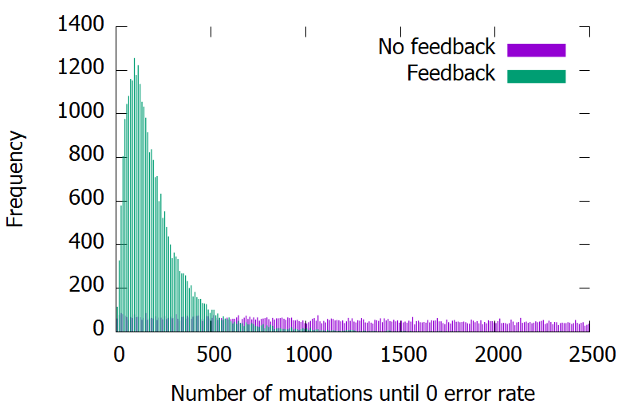

# Summary

fuzzyneural is a neural network implementation in Rust that does not use backpropagation. Well, that sounds terrible? Yeah, it is. But the goal of this project is to emulate code-coverage style feedback models in a neural network to demonstrate the impact of code coverage and feedback.

I've wanted to demonstrate the machine-learning properties of code coverage + feedback in fuzzing in a bit more robust way, and this is the project where I will attempt to do that.

This has been a project idea I've had for a while. Since fuzzing is typically very stepwise (only a few crashes per target to validate "success"), neural networks have a bonus of having a nearly infinite gradient from error functions.

# Feedback

What is feedback? Well in the case of code coverage, it's saving off inputs that caused new state in the program. These inputs are then saved and built upon.

In this neural network implementation we use feedback + random mutations rather than standard back-propagation. This should be much worse than back-propagation, but it's still leagues better than no feedback.

## How is feedback implemented in this network

- A random network is configured (random weights and biases)
- 10:
- Copy network from the best-known-network
- 1 weight is randomly mutated per layer
- The error rate is checked based on the new network
- If the error rate is lower than the previous record, save the network as the new best
- Goto 10

This feedback model is extremely similar to the most basic fuzzing feedback mechanisms, and shows how impactful of an algorithm this is. Even though it's super simple.

# Conclusion

## Basic feedback vs no feedback

Here is a graph showing the frequencies of time-to-perfect-fit for the network for basic feedback vs no feedback. This shows how much faster networks are found with this basic feedback mechanism

